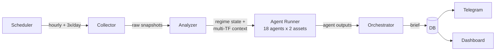

# Market Intelligence

A crypto market intelligence engine for **BTC** and **ETH**. Collects data from APIs, applies deterministic analysis, and uses LLM agents to reason about what matters — delivered as concise briefs 3x/day + a live dashboard.

This is an **information system**, not a trading bot. It surfaces what's happening, what's unusual, and why it might matter — you do the thinking.

## How It Works

**Code computes, LLMs reason.** Deterministic rules detect regimes and flag anomalies. LLM agents interpret what it means in context. An orchestrator synthesizes everything into a scannable brief.

## 18 Data Dimensions

| # | Dimension | # | Dimension |
|---|-----------|---|-----------|
| 01 | Derivatives Structure | 10 | Geopolitics & News |
| 02 | Options & IV | 11 | Cross-Market Correlations |
| 03 | Institutional Flows (ETFs) | 12 | Prediction Markets |
| 04 | Exchange Flows | 13 | Stablecoin Flows |
| 05 | Whale Activity | 14 | DeFi Activity |
| 06 | Market Sentiment | 15 | Token Unlocks |
| 07 | HTF Technical Structure | 16 | BTC Mining (BTC only) |
| 08 | LTF Technical Structure | 17 | ETH Staking & Network (ETH only) |
| 09 | Macro Environment | 18 | Equities Market Structure |

## Stack

React Router v7 · Hono.js · Prisma · PostgreSQL (PGlite) · Claude API · node-cron · grammy

## Docs

- [About](docs/about.md) — what this is, why it exists, architecture, roadmap
- [Technical Spec](docs/technical_spec.md) — stack, pipeline, dependencies, deployment
- [Data Dimensions](docs/data_dimensions.md) — all 17 dimensions with signals, regime states, and data sources
