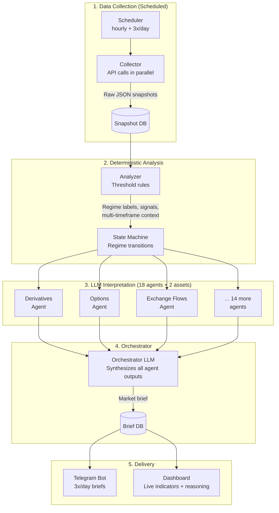

## The Market Intelligence System

A crypto market intelligence engine that collects data deterministically (APIs), uses LLM agents to reason about what matters, and delivers concise briefs 3x/day + a dashboard with core indicators and agent reasoning.

This is an **information system**, not a decision framework. It does not trade, recommend trades, or produce buy/sell signals. It surfaces what's happening, what's unusual, and why it might matter — you do the thinking.

**Phase A** — Personal intelligence feed. Dogfooding.

**Phase B** — Open as a product.

## Why This, Why Now

### The gap

- **Dashboards** (Nansen, Arkham, CoinGlass) — raw data, no reasoning, you stare at 50 charts
- **Autonomous agents** (ElizaOS, Polystrat) — black box, trades for you, usually loses money
- **News aggregators** (CryptoPanic, The Block) — firehose of headlines, no synthesis

Nobody is doing **curated intelligence with reasoning**. Something that says: "Funding flipped extreme negative after 5 days positive — this looks like capitulation, not gradual drift. Meanwhile OI is rising despite the drop, suggesting new shorts are piling in, not longs exiting. Watch for a squeeze."

Kaito does social intelligence for institutions at $thousands/month. There's no prosumer version.

## Architecture



## Brief Format

3x/day (morning, midday, evening). Each brief is a short, opinionated summary:

```
📊 MARKET BRIEF — Mon 17 Mar, 09:00 UTC

REGIME: Range-bound, low volatility

HIGHLIGHTS:
• Funding flipped negative across all major venues overnight —
  first time in 12 days. Historically this resets after 2-3 days
  of sideways action, not a trend reversal signal.

• ETH ETF saw $47M outflow yesterday, 3rd consecutive day.
  Institutional appetite cooling. Watch for reversal in flow
  direction.

• Polymarket "ETH above $4k by April" dropped from 62% → 48%
  in 48h. Crowd conviction weakening.

NOTABLE:
• OI rising while price flat — new positions being built.
  Direction unclear, but a move is loading.

UNCHANGED:
• Exchange flows still in accumulation pattern (30d: -4.2%)
• Fear & Greed at 38 (fear), stable for 5 days
```

## Dashboard

The web dashboard shows:

### Indicator Panels

Each of the 17 data dimensions gets a card:

- **Current value** + trend direction
- **Regime label** (computed deterministically)
- **Agent commentary** — LLM's interpretation of what this means right now
- **Historical sparkline**

### Brief History

- Timeline of all briefs with full agent reasoning
- Search/filter by keyword or date range

### Market State Overview

- Current regime summary (one sentence)
- Key metrics at a glance (funding, OI, F&G, ETF flows)
- "What changed" diff from previous brief

## Assets

**BTC** and **ETH**. Each asset gets its own pipeline run with all dimensions evaluated independently. Some dimensions are asset-specific (BTC mining, ETH staking), others are shared context (macro, geopolitics).

## Data Dimensions

18 analytical dimensions, each with a collector, deterministic analyzer, and LLM agent. Full spec in [data_dimensions.md](data_dimensions.md).

| #  | Dimension                | Type          | What It Watches                                  |
|----|--------------------------|---------------|--------------------------------------------------|
| 01 | Derivatives Structure    | Per-asset     | Funding, OI, liquidations, L/S ratio             |
| 02 | Options & IV             | Per-asset     | Max pain, put/call, skew, term structure         |
| 03 | Institutional Flows      | Per-asset     | ETF flows, Grayscale premiums                    |
| 04 | Exchange Flows           | Per-asset     | Exchange balances, net deposits/withdrawals      |
| 05 | Whale Activity           | Per-asset     | Large transactions, smart money moves            |
| 06 | Market Sentiment         | Shared        | Fear & Greed, social sentiment, consensus        |
| 07 | HTF Technical Structure  | Per-asset     | Weekly/daily levels, RSI, MAs, market structure  |
| 08 | LTF Technical Structure  | Per-asset     | 4H/1H momentum, intraday structure              |
| 09 | Macro Environment        | Shared        | Fed rate, CPI, DXY, yields, M2                  |
| 10 | Geopolitics & News       | Shared        | Regulatory, events, breaking news                |
| 11 | Cross-Market Correlations| Shared        | BTC vs SPX/gold/DXY, correlation regimes         |
| 12 | Prediction Markets       | Shared        | Price targets, regulatory odds                   |
| 13 | Stablecoin Flows         | Shared        | USDT/USDC supply, mint/burn, dominance           |
| 14 | DeFi Activity            | Shared        | TVL, DEX/CEX ratio, yield trends                 |
| 15 | Token Unlocks            | Per-asset     | Vesting schedules, upcoming unlocks              |
| 16 | BTC Mining               | BTC only      | Hash rate, difficulty, miner revenue/outflows    |
| 17 | ETH Staking & Network    | ETH only      | Staking rate, validator queues, burn rate, blobs |
| 18 | Equities Market Structure| Shared        | VIX, SPX/QQQ trend, breadth, sector momentum    |

## Stack

| Layer         | Tech                                              |
| ------------- | ------------------------------------------------- |
| Frontend      | React 19, React Router v7                         |
| API           | Hono.js (type-safe RPC via hono/client)           |
| ORM           | Prisma                                            |
| Database      | PostgreSQL (PGlite for local dev)                 |
| Data sources  | CoinGlass ($29/mo), CCXT, Glassnode, DefiLlama, FRED, Polymarket, CryptoPanic |
| LLM reasoning | Claude API (Anthropic SDK)                        |
| Scheduler     | node-cron (hourly + 3x/day)                       |
| Telegram      | grammy                                            |
| Hosting       | Railway                                           |

## Key Principles

- **Code computes, LLMs reason** — deterministic thresholds in code, contextual interpretation in LLM
- **Information, not decisions** — highlights and context, never buy/sell signals
- **Brevity** — briefs should be scannable in 30 seconds
- **Transparency** — every highlight traces back to specific data + agent reasoning
- **Eat your own cooking** — dogfood daily before shipping to anyone

## Phase B: Product

Only after Phase A proves useful in daily use.

### What changes

- **Multi-user** — auth, user profiles
- **Configurable briefs** — choose delivery times, focus areas, verbosity
- **Pricing** — $30-50/month (prosumer tier)
- **Real-time alerts** — websockets for intraday anomalies (OI spike, liquidation cascade, funding divergence)
- **Mobile app** — React Native

### Monetization

1. Free: 1x/day brief (delayed 6h), no dashboard
2. Pro ($30/mo): 3x/day real-time briefs, full dashboard, Telegram bot, ask-me-anything
3. Premium ($50/mo): real-time anomaly alerts, API access, custom brief schedule

## Milestones

### Phase A

- [ ] **M1: Data pipeline** — hourly + 3x/day collection across 17 dimensions for BTC & ETH
- [ ] **M2: LLM agents** — 18 specialist agents + orchestrator producing market briefs
- [ ] **M3: Telegram bot** — brief delivery 3x/day + "ask me" command
- [ ] **M4: Dashboard** — indicator panels, agent reasoning, brief history
- [ ] **M5: Iterate** — use daily for 1 month, refine prompts and brief format

### Phase B

- [ ] **M6: Multi-user** — auth, profiles
- [ ] **M7: Pricing & payments** — Stripe
- [ ] **M8: Real-time alerts** — websockets for intraday anomalies
- [ ] **M9: Mobile app** — React Native

## Name Ideas

- **Regime** — regime detection is core
- **Briefing** — it produces briefs
- **Highlight** — it highlights what matters
- **Signal House** — where data becomes insight
