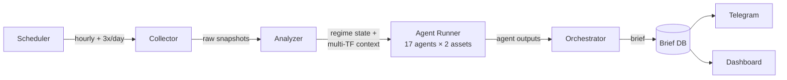

# Technical Specification

## Stack

| Layer            | Technology                                 | Notes                                                              |
| ---------------- | ------------------------------------------ | ------------------------------------------------------------------ |
| Frontend         | React 19, React Router v7 (framework mode) | SSR-capable, file-based routing                                    |
| API              | Hono.js                                    | Type-safe RPC via hono/client                                      |
| ORM / Migrations | Prisma                                     | Schema-first, typed client                                         |
| Database         | PostgreSQL via PGlite (embedded)           | Zero-config local; swap to connection URL later via `DATABASE_URL` |
| LLM              | Claude API (Anthropic SDK)                 | Agent reasoning + orchestrator                                     |
| Scheduler        | node-cron                                  | Hourly + 3x/day data collection + brief generation                 |
| Telegram         | grammy                                     | Bot delivery                                                       |
| Runtime          | Node.js 22+                                | TypeScript throughout                                              |

## Pipeline Flow



1. **Scheduler** fires at configured times (hourly for continuous tier, 3x/day for periodic tier)
2. **Collector** calls all data sources in parallel, saves raw `Snapshot` rows
3. **Analyzer** applies deterministic rules, updates regime state machine, computes multi-timeframe highs/lows/percentiles
4. **Agent Runner** sends enriched data to 17 Claude agents in parallel (one per dimension, per asset), saves `AgentOutput` rows
5. **Orchestrator** receives all agent outputs, synthesizes a `Brief`, saves to DB
6. **Telegram Bot** sends formatted brief to configured chat
7. **Dashboard** reads from DB via API — always shows latest state

## Key Dependencies

```json
{
  "dependencies": {
    "react": "^19",
    "react-dom": "^19",
    "react-router": "^7",
    "@react-router/node": "^7",
    "@react-router/serve": "^7",
    "hono": "^4",
    "@hono/node-server": "^1",
    "@prisma/client": "^6",
    "@electric-sql/pglite": "^0.2",
    "@prisma/adapter-pglite": "^6",
    "@anthropic-ai/sdk": "^0.39",
    "grammy": "^1",
    "node-cron": "^3",
    "ccxt": "^4"
  },
  "devDependencies": {
    "prisma": "^6",
    "@react-router/dev": "^7",
    "typescript": "^5.7",
    "vite": "^6",
    "@types/node": "^22",
    "@types/react": "^19",
    "@types/react-dom": "^19"
  }
}
```

## Deployment

- **Single process**: Hono serves both the API and the React Router SSR app
- **PGlite → Postgres migration**: Set `DATABASE_URL`, remove PGlite adapter — no other code changes needed
- **Target platform**: Railway
- **Data directory**: PGlite stores data in `./data/pglite/` — persist via volume mount in production
